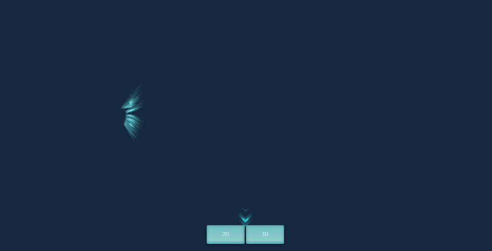
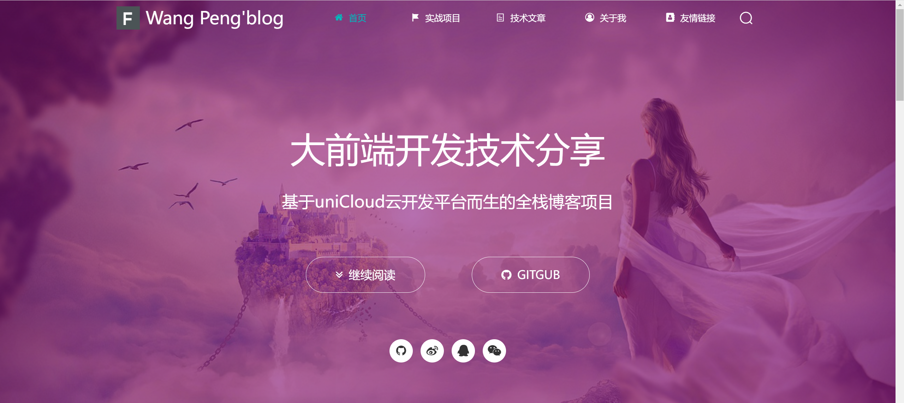

# 首页
<p align="center">
    
    
    
    
</p>

- 该项目是旨在提供前端项目的可视化展示导航页面，将作者开源并部署的项目进行一个效果展示。

- 目前计划采用CSS3和THREE来实现，2D和3D可视化的页面效果展示。

- 内部案例均已开源，如果觉着还不错的话，就请点个 ⭐star 支持一下吧，这将是对我最大的支持和鼓励！

  

- 如果觉着还不错的话，就请点个 ⭐star 支持一下吧，这将是对我最大的支持和鼓励！

### 页面展示

1、首页（图片效果为加速后效果）

 <table>
    <tr>
        <td></td>
    </tr>
  </table>

1、2d视图

 <table>
    <tr>
        <td></td>
    </tr>
  </table>

2、3d视图

 <table>
    <tr>
        <td></td>
    </tr>
  </table>


### 技术栈

```
页面动效采用HTML5、CSS3和three.js库进行开发
如三维字体、项目轮播等。
```

### 开发功能点

#### 2022-4-1

```
1、完成首页效果
2、完成2d页面基础效果
```

#### 待完善点

```
1、2d页面的项目轮播内容待填充
2、3d页面待开发
```

